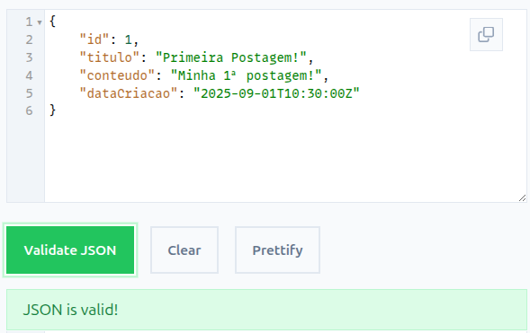
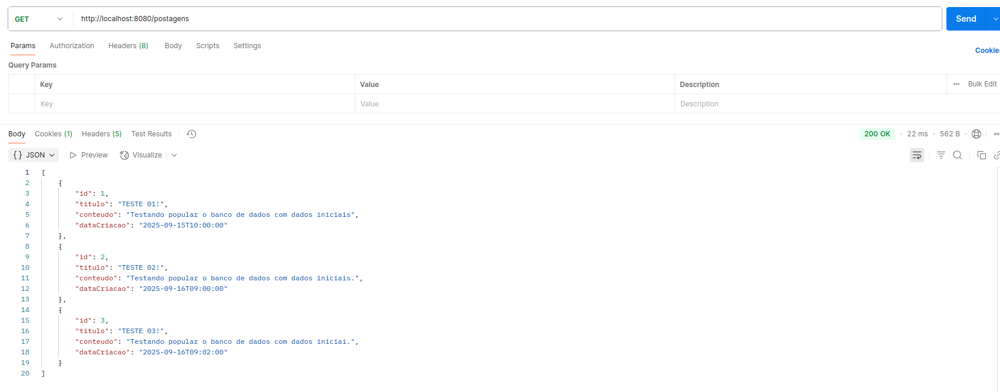
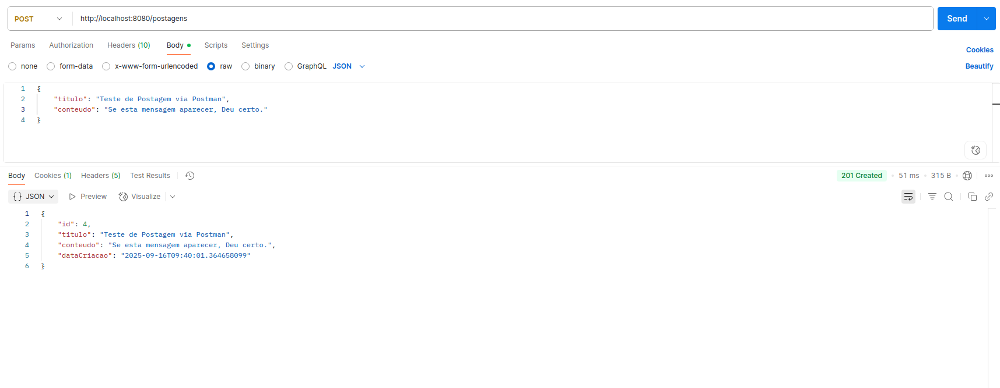
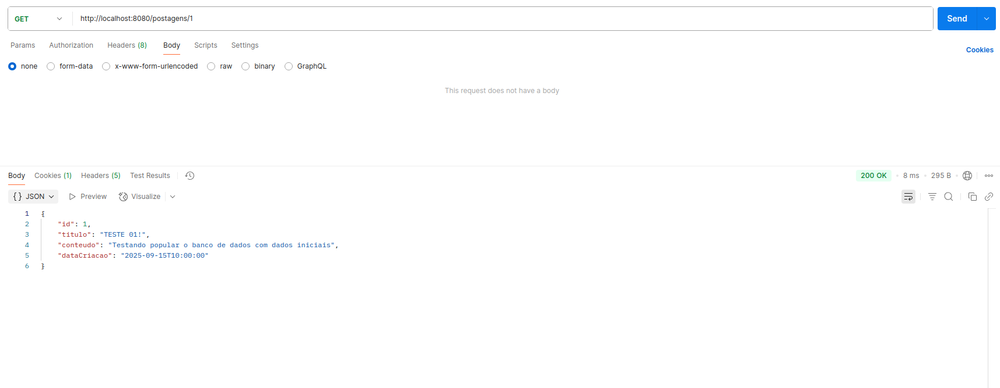

# Modelagem de API

Nesta atividade, você irá modelar dados para uma API de posts do **IFgram** (o Instagram do IF), baseando-se nos seguintes conceitos de domínio:

### Postagem

* Representa conteúdos compartilhados pelos usuários, como fotos, textos ou links.
* **Atributos:** `id`, `titulo`, `conteudo`, `dataCriacao`.

---


## Exercício 1 : 


Baseado na especificação do início deste documento para o IFgram, modele endpoints, preenchendo a tabela com a modelagem da sua API, bem como a especificação do esquema (Schema) em JSON. Para validar o seu JSON, use algum site de validação.


### Especificação do esquema em JSON

O esquema a seguir representa um único recurso **Postagem**, conforme os atributos definidos no documento (`id`, `titulo`, `conteudo`, `dataCriacao`).

```
{
  "id": 1,
  "titulo": "Primeira Postagem!",
  "conteudo": "Minha 1ª postagem!",
  "dataCriacao": "2025-09-01T10:30:00Z"
}

```



# Definição dos endpoints para o recurso

A tabela a seguir representa os endpoints para o recurso **Postagem**.

| **Verbo HTTP** | **Endpoints (path)** | **Descrição** | **Input** | **Outputs** | **Cód. Sucesso** | **Cód. Falha** |
| :--- | :--- | :--- | :--- | :--- | :--- | :--- |
| **GET** | `/postagens` | Listagem de todas as postagens. | *(Nenhum)* | `[{ "id": 1, "titulo": "...", "conteudo": "...", "dataCriacao": "..." }, { "id": 2, "titulo": "...", "conteudo": "...", "dataCriacao": "..." }]` | 200 OK | 500 Internal Server Error |
| **POST** | `/postagens` | Adição de uma nova postagem. | `{ "titulo": "Nova Postagem", "conteudo": "Conteúdo aqui." }` | `{ "id": 3, "titulo": "Nova Postagem", "conteudo": "Conteúdo aqui.", "dataCriacao": "..." }` | 201 Created | 400 Bad Request |
| **GET** | `/postagens/{id}` | Detalhes de uma postagem específica. | *(Nenhum)* | `{ "id": 1, "titulo": "...", "conteudo": "...", "dataCriacao": "..." }` | 200 OK | 404 Not Found |
| **PUT** | `/postagens/{id}` | Atualização de uma postagem existente. | `{ "titulo": "Título Atualizado", "conteudo": "Conteúdo atualizado." }` | `{ "id": 1, "titulo": "Título Atualizado", "conteudo": "Conteúdo atualizado.", "dataCriacao": "..." }` | 200 OK | 400 Bad Request / 404 Not Found |
| **DELETE** | `/postagens/{id}` | Remoção de uma postagem. | *(Nenhum)* | *(Corpo da resposta vazio)* | 204 No Content | 404 Not Found |

---

## Exercício 2: 

Implemente a API que você modelou em um projeto **Java** com **Spring Web MVC**, seguindo as práticas e exemplos apresentados em sala de aula.

A API modelada foi implementada em um projeto Java com Spring Web MVC.

### Referências

Para a construção dos endpoints e conexão com o banco de dados, foram utilizados como referência os seguintes vídeos. Embora os originais utilizem Kotlin, os conceitos foram adaptados para Java nesta implementação:

-   [Spring boot #2 - VEJA COMO É FÁZIL CONECTAR UM BANCO DE DADOS NO SPRING BOOT](https://www.youtube.com/watch?v=DLMsJrVy07o)
-   [Spring boot #3 - CRIE SEU PRIMEIRO ENDPOINT NO SPRING BOOT](https://www.youtube.com/watch?v=9suzNsWAeps&t=555s)

### Testes dos Endpoints via Postman

As imagens a seguir documentam os testes realizados em cada um dos cinco endpoints da API utilizando o Postman. Presume-se que as imagens estão na pasta `assets/images/` na raiz do projeto.

**1. Listagem de todas as postagens (GET /postagens)**


**2. Criação de uma nova postagem (POST /postagens)**


**3. Detalhes de uma postagem específica (GET /postagens/{id})**


**4. Atualização de uma postagem (PUT /postagens/{id})**


**5. Remoção de uma postagem (DELETE /postagens/{id})**


**6. Confirmação da remoção (GET /postagens)**


